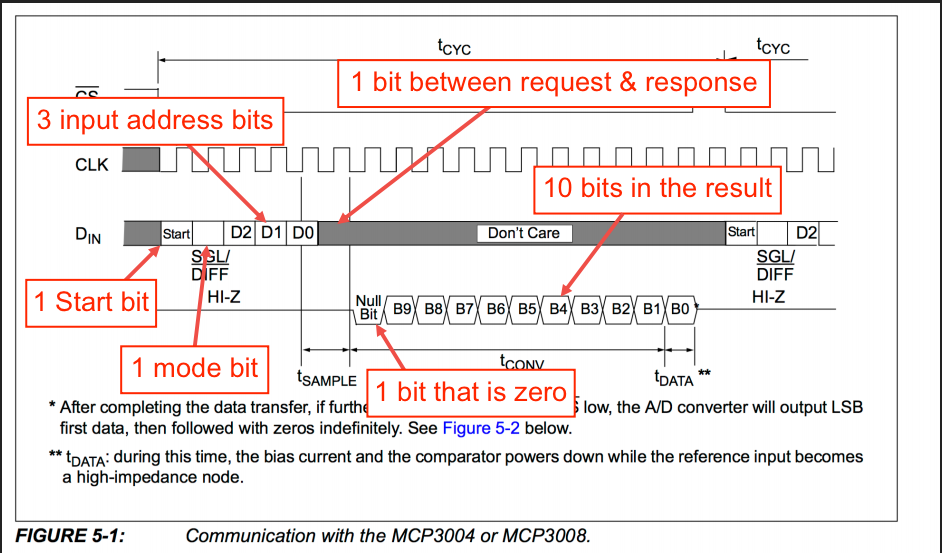
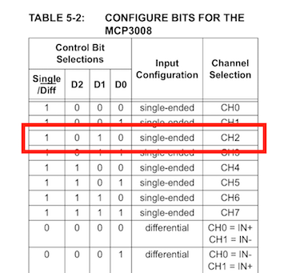
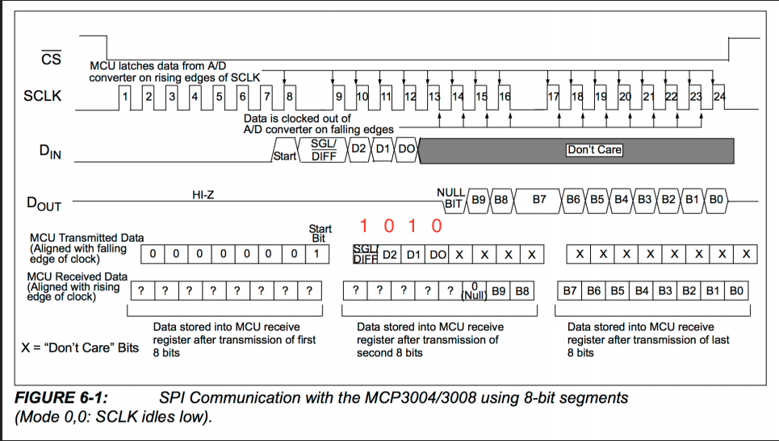

# elixir_ale - Elixir Actor Library for Embedded

`elixir_ale` provides high level abstractions for interfacing to GPIOs, I2C
buses and SPI peripherals on Linux platforms. Internally, it uses the Linux
sysclass interface so that it does not require platform-dependent code.

`elixir_ale` works great with LEDs, buttons, many kinds of sensors, and simple
control of motors. In general, if a device requires high speed transactions or
has hard real-time constraints in its interactions, this is not the right
library. For those devices, it is recommended to look at other driver options, such
as using a Linux kernel driver.

If this sounds similar to [Erlang/ALE](https://github.com/esl/erlang-ale), that's because it is. This
library is a Elixir-ized implementation of the original project with some updates
to the C side. (Many of those changes have made it back to the original project
now.)

# Getting started

If you're natively compiling elixir_ale, everything should work like any other
Elixir library. Normally, you would include elixir_ale as a dependency in your
`mix.exs` like this:

    def deps do
      [{:elixir_ale, "~> 0.5.7"}]
    end

If you just want to try it out, you can do the following:

    git clone https://github.com/fhunleth/elixir_ale.git
    cd elixir_ale
    mix compile
    iex -S mix

If you're cross-compiling, you'll need to setup your environment so that the
right C compiler is called. See the `Makefile` for the variables that will need
to be overridden. At a minimum, you will need to set `CROSSCOMPILE`,
`ERL_CFLAGS`, and `ERL_EI_LIBDIR`.

`elixir_ale` doesn't load device drivers, so you'll need to make sure that any
necessary ones for accessing I2C or SPI are loaded beforehand. On the Raspberry
Pi, the [Adafruit Raspberry Pi I2C
instructions](https://learn.adafruit.com/adafruits-raspberry-pi-lesson-4-gpio-setup/configuring-i2c)
may be helpful.

If you're trying to compile on a Raspberry Pi and you get errors indicated that Erlang headers are missing
(`ie.h`), you may need to install erlang with `apt-get install
erlang-dev` or build Erlang from source per instructions [here](http://elinux.org/Erlang).

# Examples

`elixir_ale` only supports simple uses of the GPIO, I2C, and SPI interfaces in
Linux, but you can still do quite a bit. The following examples were tested on a
Raspberry Pi that was connected to an [Erlang Embedded Demo
Board](http://solderpad.com/omerk/erlhwdemo/). There's nothing special about
either the demo board or the Raspberry Pi, so these should work similarly on
other embedded Linux platforms.

## GPIO

A GPIO is just a wire that you can use as an input or an output. It can only be
one of two values, 0 or 1. A 1 corresponds to a logic high voltage like 3.3 V
and a 0 corresponds to 0 V. The actual voltage depends on the hardware.

Here's an example of turning an LED on or off:

To turn on the LED that's connected to the net (or wire) labeled
`GPIO18`, run the following:

    iex> alias ElixirALE.GPIO
    iex> {:ok, pid} = GPIO.start_link(18, :output)
    {:ok, #PID<0.96.0>}

    iex> GPIO.write(pid, 1)
    :ok

Input works similarly. Here's an example of a button with a pull down
resister connected.

If you're not familiar with pull up or pull down
resisters, they're resisters whose purpose is to drive a wire
high or low when the button isn't pressed. Without the resistor, the circuit may
be left in a floating (or high impedance) state. The high-impedance state occurs 
when the pin is not pulled to a high or low logic level, but is left “floating” 
instead. The floating state may be misinterpreted by the microprocessor.  In 
this case, it drives the wire low. Many processors have ways of configuring 
internal resisters to accomplish the same effect without needing to add an 
external resister.  It's platform-dependent and not shown here.

The code looks like this in `elixir_ale`:

    iex> {:ok, pid} = GPIO.start_link(17, :input)
    {:ok, #PID<0.97.0>}

    iex> GPIO.read(pid)
    0

    # Push the button down

    iex> GPIO.read(pid)
    1

If you'd like to get a message when the button is pressed or released, call the
`set_int` function. You can trigger on the `:rising` edge, `:falling` edge or
`:both`.

    iex> GPIO.set_int(pid, :both)
    :ok

    iex> flush
    {:gpio_interrupt, 17, :rising}
    {:gpio_interrupt, 17, :falling}
    :ok

Note that after calling `set_int`, the calling process will receive an initial 
message with the state of the pin.  This prevents the race condition between 
getting the initial state of the pin and turning on interrupts. Without it, 
you could get the state of the pin, it could change states, and then you could 
start waiting on it for interrupts. If that happened, you would be out of sync.

## SPI

A Serial Peripheral Interface (SPI, pronounced "spy") bus is a common multi-wire 
bus used to connect components on a circuit board. A clock line drives the 
timing of sending bits between components. Bits on the Master Out Slave In `MOSI` 
line go from the master (usually the processor running Linux) to the slave, 
and bits on the Master In Slave Out `MISO` line go the other direction. Bits 
transfer both directions simultaneously. However, much of the time, the 
protocol used across the SPI bus has a request followed by a response and in 
these cases, bits going the "wrong" direction are ignored.  This will become 
more clear in the example below.

The following shows an example MCP3008 Analog to Digital Converter (ADC) that reads from 
an analog moisture sensor, converts the analog measurements to digital, and 
sends the digital measurements to SPI pins on a Raspberry Pi.  An ADC is 
used to convert the analog signal from a sensor to a digital signal, so the 
signal can be read by the main processor running Linux (e.g. Raspberry Pi.) 
A Raspberry Pi can't read an analog signal, so it needs an ADC to convert the
signal to digital.

TODO UPDATED SCHEMATIC?

The protocol for talking to the ADC can be found on the MCP3008 data sheet 
which you will find on the [MCP3008 product page](http://www.microchip.com/wwwproducts/en/MCP3008).  If 
you are new to hardware, a data sheet can be intimidating but they become
much easier to read once you know what you are looking for.  The protocol
is very similar to an application program interface (API) in the software world.

In the case of the MCP3008, the protocol is found in section 5.0 "SERIAL 
COMMUNICATION" on page 19.  The protocol will tell you the position and 
function of the bits you will send to the ADC, along with how the data (in the 
form of bits) will be returned.

Figure 5-1 on pg 20 will help us figure out the protocol.  It shows 4 lines, CS 
(chip select), CLK (clock), DIN (data in), and DOUT (data out).  We'll look at 
the DIN line first to determine what to send.  Then we'll look at the DOUT line 
to determine what we will receive (DOUT label is covered by the "1 Start bit" 
box.

The DIN line describes what the request should look like.  It should have 1 
start bit, 1 mode bit, and 3 input address bits to select a channel.  The 
MCP3008 has 8 (0-7) channels to which you can connect a sensor.  These are 
described in greater detail in table 5.2 on page 19.

For the sample below, we want to send a single-ended mode request to the 
channel 2 (CH2) sensor.  So we need a start bit `1`, a `1` bit for the mode, and 
3 bits, `010`, to select the sensor.  By comparing the DIN and DOUT lines to 
the CLK line, you can tell there is 1 bit between the response and request.  For 
that bit and the remaining bits, the DIN doesn't care.  We will send `0`
bits in these places for the request.

Now we move down to the response in the DOUT line.  We can see it begins with 
a null bit `0` and then there are 10 bits of data.  The response is going to 
be a binary number with a minumum value of 0 and a maximum value of 1023.  1023
 is the maximum binary number that can be represented using 10 bits.

We mentioned receiving and sending happen at the same time.  So we will begin 
reading bits as soon as we send the request.  We will also send bits covering 
the entire request/response cycle.  So our protocol (i.e. API) contains 5 bits 
in the request, 1 bit between the request and response, 1 null bit, and 10 bits 
of data.  Our protocol contains a total of 17 bits.

However, we have a problem.  Our Raspberry Pi, along with most microcontrollers, 
can only send requests using bytes (8 bits.)  We are 1 bit over a 2 byte 
message.  Luckily the data sheet provides a solution to this problem in 
section 6.0 APPLICATIONS INFORMATION.  The section goes into greater detail, 
but figure 6.1 tell us how to modify the request/response to resolve the issue.

The MCU Transmitted Data row tells us to send 7 `0` bits before the start 
bit.  Combined with our 17 bit request/response communication, this will give us a 
total of 24 bits and 3 bytes.  We can see from the MCU Received Data row we'll 
need to take those 7 bits into account when we receive the data, but we'll also 
receive 24 bits or 3 bytes.

Using the protocol from the data sheet here is how we will read the moisture 
sensor.

    # Make sure that you've enabled or loaded the SPI driver or this will
    # fail.
    iex> alias ElixirALE.SPI
    iex> {:ok, pid} = SPI.start_link("spidev0.0")
    {:ok, #PID<0.124.0>}

    # Read the moisture sensor

    # Use binary pattern matching to pull out the ADC counts (low 10 bits)
    iex> mode = 1 #Single-ended mode
    iex> sensor = 2 #Try the CH2 sensor
    iex> <<_::size(14), value::size(10)>> =
           SPI.transfer(pid, <<0x01, mode::size(1), sensor::size(3), 0::size(12)>>)
    TODO "NEED WHAT IT RETURNS"

    iex> IO.puts "Sensor #{sensor} measured #{value}"
    TODO "NEED WHAT IT RETURNS"

If you are new to using Elixir for embedded, there may be some things here you 
might not be familiar with.  We'll be working with bit strings.  If this is 
new to you, you might want to refer to the 
[Elixir docs for bitstings](https://hexdocs.pm/elixir/Kernel.SpecialForms.html#%3C%3C%3E%3E/1).

First we call SPI.start_link with Linux spidev device driver as it argument.  
We pattern match with `{:ok, pid}` so we can use `pid` in the 
SPI.transfer call next.

    {:ok, pid} = SPI.start_link("spidev0.0")

Elixir ALE uses the Linux spidev device driver for communicating with SPI 
devices. It creates files in /dev for each SPI interface that it knows about. 
Many boards only have one SPI interface and it shows up as /dev/spidev0.0. 
The easiest way to find out the right name is to run ls spidev* in the /dev 
directory. If nothing shows up, it is likely that the spidev driver needs to 
be loaded. Try running modprobe spidev or consult your board's documentation.

Next we'll make a call to SPI.transfer to read the moisture sensor.

    SPI.transfer(pid, <<0x01, mode::size(1), sensor::size(3), 0::size(12)>>)

We are building the bitstring in 4 segments.  The first segement `0x01`, is the 
hexadecimal representation of `00000001` that we determined above we need to 
send in the first byte.  The final bit `1` will be the start bit.  It is 
common to describe bytes using hexadecimal notation.

The next bit will be for the mode which we have set to 1 for Single-ended mode.

TODO:  The slides say 0 for Single-ended mode, but that doesnt' seem to match 
the data sheet. Need to verify which is correct.

Next we will send 3 bits to select the sensor on channel 2.  As we found above in 
Table 5-2 on pg 19 of the data sheet `010` will select channel 2 
(CH2).  `2::size(3)` is equivalent to `010` and sends the binary number 2 
using 3 bits.  We could send 2 in binary using 2 bits `10`, but we need 3 bits 
to comply with the protocol.

Finally we include 12 bits corresponding with the 1 bit between request & 
response, the 1 null bit that is zero, and the 10 bits returning the result.  The
ADC does not care about these bits so we just send 12 `0` bits.

Now we'll pattern match the response to get the returned value. 

    <<_::size(14), value::size(10)>> =

As we said above, receiving and sending happen at the same time.  So we will begin 
reading bits as soon as we send the request.  We are sending 3 bytes or 24 bits 
so we will also receive 3 bytes or 24 bits.  We know only the last 10 bits will 
contain the data.  So we pattern match against the first 14 bits and discard 
the result, `_::size(14)` then we bind the last 10 bits to the variable `value`, 
`value::size(10)`.

Now our application can use the data returned from the moisture sensor.

    IO.puts "Sensor #{sensor} measured #{value}"

## I2C

An I2C bus is similar to a SPI bus in function, but uses fewer wires. It
supports addressing hardware components and bidirectional use of the data line.

The following shows a bus IO expander connected via I2C to the processor.

The protocol for talking to the IO expander is described in the [MCP23008
Datasheet](http://www.microchip.com/wwwproducts/Devices.aspx?product=MCP23008).
Here's a simple example of using it.

    # On the Raspberry Pi, the IO expander is connected to I2C bus 1 (i2c-1).
    # Its 7-bit address is 0x20. (see datasheet)
    iex> alias ElixirALE.I2C
    iex> {:ok, pid} = I2C.start_link("i2c-1", 0x20)
    {:ok, #PID<0.102.0>}

    # By default, all 8 GPIOs are set to inputs. Set the 4 high bits to outputs
    # so that we can toggle the LEDs. (Write 0x0f to register 0x00)
    iex> I2C.write(pid, <<0x00, 0x0f>>
    :ok

    # Turn on the LED attached to bit 4 on the expander. (Write 0x10 to register
    # 0x09)
    iex> I2C.write(pid, <<0x09, 0x10>>)
    :ok

    # Read all 11 of the expander's registers to see that the bit 0 switch is
    # the only one on and that the bit 4 LED is on.
    iex> I2C.write(pid, <<0>>)  # Set the next register to be read to 0
    :ok

    iex> I2C.read(pid, 11)
    <<15, 0, 0, 0, 0, 0, 0, 0, 0, 17, 16>>

    # The operation of writing one or more bytes to select a register and
    # then reading is very common, so a shortcut is to just run the following:
    iex> I2C.write_read(pid, <<0>>, 11)
    <<15, 0, 0, 0, 0, 0, 0, 0, 0, 17, 16>>

    # The 17 in register 9 says that bits 0 and bit 4 are high
    # We could have just read register 9.

    iex> I2C.write_read(pid, <<9>>, 1)
    <<17>>

## FAQ

### Where can I get help?

Most issues people have are on how to communicate with hardware for the first
time. Since `elixir_ale` is a thin wrapper on the Linux sys class interface, you
may find help by searching for similar issues when using Python or C.

For help specifically with `elixir_ale`, you may also find help on the
nerves channel on the [elixir-lang Slack](https://elixir-slackin.herokuapp.com/).
Many [Nerves](http://nerves-project.org) users also use `elixir_ale`.

### Why isn't elixir_ale a NIF?

While `elixir_ale` should never crash, it's hard to guarantee that weird
conditions on the I2C or SPI buses wouldn't hang the Erlang VM. `elixir_ale`
errors on the side of safety of the VM.

### I tried turning on and off a GPIO as fast as I could. Why was it slow?

Please don't do that - there are so many better ways of accomplishing whatever
you're trying to do:

  1. If you're trying to drive a servo or dim an LED, look into PWM. Many
     platforms have PWM hardware and you won't tax your CPU at all. If your
     platform is missing a PWM, several chips are available that take I2C
     commands to drive a PWM output.
  2. If you need to implement a wire level protocol to talk to a device, look
     for a Linux kernel driver. It may just be a matter of loading the right
     kernel module.
  3. If you want a blinking LED to indicate status, `elixir_ale` really should
     be fast enough to do that, but check out Linux's LED class interface. Linux
     can flash LEDs, trigger off events and more. See [nerves_leds](https://github.com/nerves-project/nerves_leds).

If you're still intent on optimizing GPIO access, you may be interested in
[gpio_twiddler](https://github.com/fhunleth/gpio_twiddler).

### Where's PWM support?

On the hardware that I normally use, PWM has been implemented in a
platform-dependent way. For ease of maintenance, `elixir_ale` doesn't have any
platform-dependent code, so supporting it would be difficult. An Elixir PWM
library would be very interesting, though, should anyone want to implement it.

### Can I develop code that uses elixir_ale on my laptop?

You'll need to fake out the hardware. Code to do this depends
on what your hardware actually does, but here's one example:

  * http://www.cultivatehq.com/posts/compiling-and-testing-elixir-nerves-on-your-host-machine/

Please share other examples if you have them.

### How do I debug?

The most common issue is getting connected to a part the first time. If you're
having trouble, check that the device files exist in the `/dev` directory for I2C
and SPI. GPIOs are usually come up easier, but their corresponding files are in
`/sys/class/gpio`. Are ARM-based boards, it is common to need to specify a
device tree file to the Linux kernel that specifies whether pins on I2C, SPI, or
GPIOs. Some boards also support device tree overlays that can be installed at
run time to change the usage of pins (the BeagleBone Black is a good example of
this. See the [Universal I/O
project](https://github.com/cdsteinkuehler/beaglebone-universal-io). If
debugging I2C, see `I2C.detect_devices/1` for scanning the whole bus for
anything in case the device you're using is at a different address than
expected.

### Will it run on Arduino?

No. Elixir ALE only runs on Linux-based boards. If you're interested in controlling an Arduino from a computer that can run Elixir, check out [nerves_uart](https://hex.pm/packages/nerves_uart) for communicating via the Arduino's serial connection or [firmata](https://github.com/mobileoverlord/firmata) for communication using the Arduino's Firmata protocol.

### Can I help maintain elixir_ale?

Yes! If your life has been improved by `elixir_ale` and you want to give back,
it would be great to have new energy put into this project. Please email me.

# License

This library draws much of its design and code from the Erlang/ALE project which
is licensed under the Apache License, Version 2.0. As such, it is licensed
similarly.
